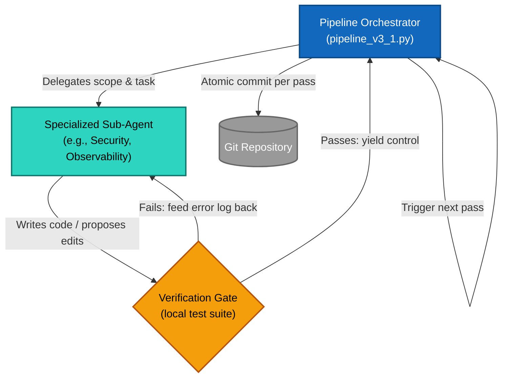

# ai-factory-setup

**An artifact-driven, 8-pass agentic pipeline for enterprise software development using OpenCode.**

> _"Stop asking AI to write code. Start orchestrating AI to build software."_

[](https://www.gnu.org/licenses/agpl-3.0)

---

## The Problem

Ad-hoc agentic coding fails at the enterprise level for three reasons:

1. **Context Bloat** — Dumping entire codebases into a single prompt burns millions of tokens and causes "lost in the middle" attention drift.
2. **Spaghetti Edits** — Asking one model to write logic, enforce security, and format logs simultaneously causes "lazy coding" on at least one constraint.
3. **Specification Drift** — Agents change the code but leave the architecture docs untouched, creating a legacy codebase on day one.

## The Solution: AI as an Assembly Line

Instead of a zero-shot prompt, this framework breaks software development into a **strict 8-pass sequential pipeline**. Each pass is handled by a specialized sub-agent with a deeply constrained scope.

```
Pass 0  Design & Architecture  →  design.mmd + spec.gherkin  [HITL gate]
Pass 1  Contracts & Types      →  type stubs in target file
Pass 2  TDD Test Generation    →  test file                   [Red Phase]
Pass 3  Core Implementation    →  logic                       [Green Phase + self-correction]
Pass 4  Refactor & Optimise    →  complexity/DRY              [self-correction]
Pass 5  Security Hardening     →  OWASP Top-10               [self-correction]
Pass 6  Observability & Logs   →  logging + error classes     [self-correction]
Pass 7  Documentation          →  docstrings + @see links
```

Each guarded pass runs your local test suite and self-corrects (up to 2 retries) before advancing. Every pass produces an **atomic git commit** — so if an agent breaks something, you `git revert` one step and retry.

---

## Architecture at a Glance



**Three cost-critical invariants** are baked into the orchestrator:

| Invariant | What it does |
|-----------|-------------|
| **Static Prefix** | Files are attached in a locked order (`design.mmd` → `spec.gherkin` → target). Every pass shares the same cacheable prefix → ~90% discount on input tokens. |
| **Context Compaction** | Error logs are written to `.opencode_error.log`, then deleted the moment tests pass. No debugging context bleeds across passes. |
| **Single-Model Lock** | Model is declared in each agent's YAML frontmatter — never overridden by the orchestrator. Cache pool stays intact. |

---

## Repository Structure

```
ai-factory-setup/
├── .opencode/               # Agent engine: agents.xml + 8 agent .md files
│   └── agent/               # One .md file per pipeline pass
├── docs/
│   ├── architecture-manifesto.md   # Full design rationale & diagrams
│   └── roadmap.md
├── examples/
│   └── basic-addition/      # Verified integration test (run this first!)
│       ├── basic_addition.py
│       ├── basic_addition_test.py
│       ├── design.mmd
│       └── spec.gherkin
├── infra/
│   ├── docker-compose.yml   # LiteLLM proxy stack
│   └── litellm_config.yaml  # Model routing configuration
├── src/
│   └── pipeline_v3_1.py     # The orchestrator (the engine)
├── .env.example             # API key template
├── requirements.txt
└── README.md
```

---

## Quick Start

### Prerequisites

- Python 3.11+
- [opencode CLI](https://opencode.ai) (`npm install -g opencode-ai`)
- An [OpenRouter](https://openrouter.ai) API key
- `git` initialized in your working directory

### 1. Install dependencies

```bash
pip install -r requirements.txt
```

### 2. Configure your API key

```bash
cp .env.example .env
# Edit .env and add your OPENROUTER_API_KEY
```

### 3. Run the example

```bash
# Run the full 8-pass pipeline against the basic-addition example
python src/pipeline_v3_1.py examples/basic-addition/basic_addition.py

# Skip the human approval gate (for CI/automated use)
python src/pipeline_v3_1.py examples/basic-addition/basic_addition.py --skip-hitl

# Just run the tests directly (no API calls)
pytest examples/basic-addition/ -v
```

### 4. Run against your own file

```bash
python src/pipeline_v3_1.py path/to/your/module.py --test-cmd "pytest path/to/tests/ -x"
```

---

## The Infrastructure Layer (Optional)

For enterprise use, route all agent traffic through a self-hosted **LiteLLM** proxy. This gives you:

- **Budget control** per developer/department
- **Model routing** (cheap models for docs, frontier models for security)
- **PII masking** before prompts leave your network

```bash
cd infra/
docker compose up -d
# LiteLLM proxy now running at http://localhost:4000
```

See `docs/architecture-manifesto.md` for the full enterprise architecture including SSO, Bloop semantic indexing, and DevContainer sandboxing.

---

## Agent Configuration

Agents are defined in `.opencode/agents.xml` and `.opencode/agent/*.md`. Each agent file has YAML frontmatter that locks the model, permissions, and scope.

The pipeline enforces that agents can only:
- **Read**: their assigned files (`design.mmd`, `spec.gherkin`, target source)
- **Write**: only the files appropriate to their pass (e.g., the Docs agent can only edit comments)
- **Execute**: nothing — no bash, no web fetch

See `docs/architecture-manifesto.md` § 4 for the full agent guardrail design.

---

## License

GNU Affero General Public License v3.0 — see [LICENSE](LICENSE) for details.

This means: you can use, study, and modify this freely. If you run a modified version as a network service, you must release your modifications under the same license.
